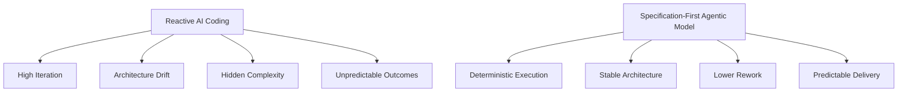

# Why Defining the System in Advance Matters

## Specification-First Engineering in the Age of AI Agents

As AI agents become increasingly integrated into software development workflows, the structure and clarity of system definitions become critical.

This research investigates a fundamental shift:

> In agentic engineering, clarity scales.  
> Ambiguity also scales.  
> The difference lies in specification maturity.

---

# Two Development Paradigms

## 1️⃣ Reactive AI Development (Vibe-Centric)

- Start coding immediately
- Prompt AI iteratively
- Fix outputs reactively
- Patch architecture after implementation
- Accumulate hidden complexity

This model often leads to:

- High iteration loops
- Architectural drift
- Inconsistent output quality
- Unpredictable delivery timelines

---

## 2️⃣ Specification-First Agentic Development

- Define domain boundaries
- Define invariants and constraints
- Define flows and contracts
- Define quality and validation criteria
- Then orchestrate AI agents to implement

This approach leads to:

- Deterministic execution
- Stable architectural structures
- Lower rework
- Predictable delivery cycles

---

# Structural Difference (Diagram)

# Comparative Analysis

| Dimension               | Reactive / Vibe Coding | Spec-Driven Agentic     |
| ----------------------- | ---------------------- | ----------------------- |
| Predictability          | Low                    | High                    |
| Rework                  | High                   | Reduced                 |
| Architectural Stability | Drifts over time       | Preserved               |
| AI Output Quality       | Inconsistent           | Constrained & Reliable  |
| Cost Efficiency         | Reactive correction    | Front-loaded clarity    |
| Delivery Control        | Iterative & reactive   | Structured & measurable |

---

# The Core Engineering Principle

AI agents are:

- Probabilistic
- Pattern-driven
- Context-limited

They perform best when:

- Constraints are explicit
- Boundaries are defined
- Outputs are structurally validated
- Success criteria are measurable

Without specifications, agents amplify ambiguity.  
With specifications, agents amplify clarity.

---

# Why This Matters More with Agents

In traditional development:

> Poor specifications slow down coding.

In agentic development:

> Poor specifications amplify chaos.

Agents scale execution.  
They also scale structural weaknesses.

A specification-first approach transforms AI agents from reactive coding assistants into deterministic execution engines.

---

# Engineering Determinism in a Probabilistic Era

The deeper objective is not simply acceleration.

It is the restoration of engineering determinism within AI-assisted workflows.

- Specifications define intent.
- Architecture defines structure.
- Agents execute within constraints.

Therefore:

> Agentic engineering is specification-centric by nature.

---

# Strategic Outcome

By defining the system in advance:

- Complexity is controlled before execution
- AI outputs become consistent and auditable
- Rework decreases
- Architectural integrity is preserved
- Delivery becomes predictable

The result is not just faster development —  
but structurally sound, scalable, and repeatable engineering systems.
