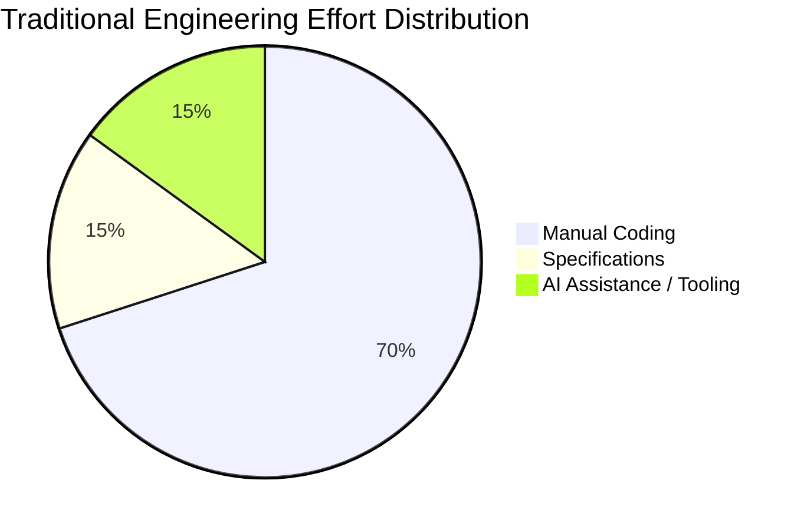
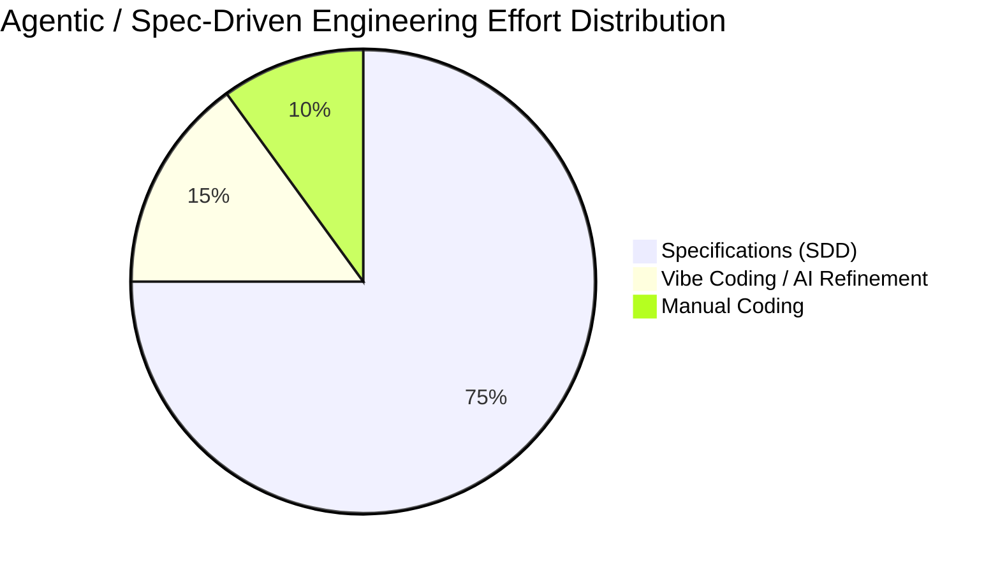
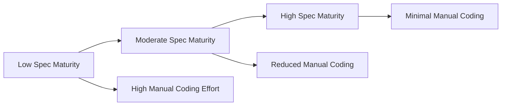

# Research Focus

## From Coding to Specification-Driven Agents

Traditional software development concentrates most engineering effort on manual coding.  
Recent trends such as AI-assisted “Vibe Coding” reduce friction, but still rely heavily on iterative prompting, supervision, and correction.

My research explores a structural shift in how software engineering effort is allocated:

> Move the center of gravity from human coding to AI agents orchestrated by high-quality specifications.

---

## Core Thesis

Instead of:

- Spending most effort writing and fixing code
- Iterating prompts reactively
- Relying on trial-and-error AI interactions

The proposed model prioritizes:

- **70–80% effort in precise specification design (Spec-Driven Development – SDD)**
- **10–15% effort in AI-assisted refinement (Vibe Coding)**
- **Minimal manual coding reserved for complex or brownfield scenarios**

Coding does not disappear.

However, as specification maturity increases, human coding effort decreases proportionally — leading to:

- Reduced cost
- Shorter delivery cycles
- More predictable outcomes
- Improved structural quality
- Stronger architectural consistency

This research focuses on restoring determinism and engineering rigor in the age of AI-driven development.

---

# Effort Reallocation Model

## Chart 1 — Engineering Effort Distribution

### Traditional Model

- Coding: 70%
- Specifications: 15%
- AI Assistance: 15%

### SDD + Agentic Model

- Specifications: 70–80%
- Vibe Coding: 10–15%
- Manual Coding: 5–15%

Chart 2 — Specification Maturity vs Manual Coding Effort

As specification maturity increases, manual coding effort decreases.
Chart 2 — Specification Maturity vs Manual Coding Effort

As specification maturity increases, manual coding effort decreases.

## Research Implications

This model reframes software engineering as a specification-first discipline supported by intelligent agents.

### Key implications:

Engineering effort becomes front-loaded toward clarity and structure.

AI agents operate deterministically from structured specifications.

Iterative prompting is minimized.

Brownfield and complex systems still require expert intervention.

Process maturity (CMMI-aligned thinking) becomes a multiplier for AI effectiveness.

## Strategic Outcome

The long-term objective is not to eliminate coding.

The objective is to:

Reduce unnecessary human coding

Increase predictability

Lower cost and risk

Improve architectural quality

Enable scalable, repeatable delivery systems

In this model, specifications become the primary artifact of engineering —
and AI agents become execution engines.

Software development evolves from code-centric to specification-centric engineering.
